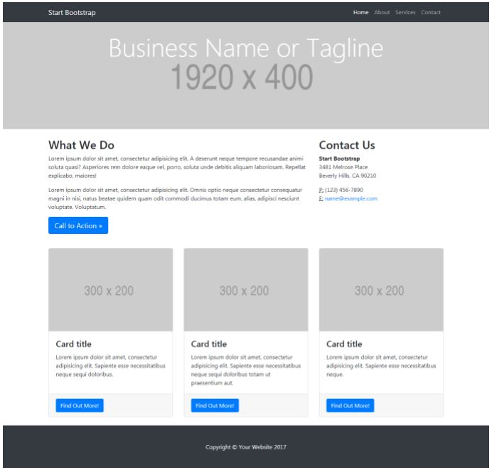

# RETO: Mi Página Web

* El objetivo del presente reto es el de crear una página web usando los conocimientos adquiridos sobre el **grid-system**, **diseño responsivo** y **mobile-first**.

* Se nos proporcionó una estructura base de página web: 

>vista tablet/desktop:

>vista mobile:

